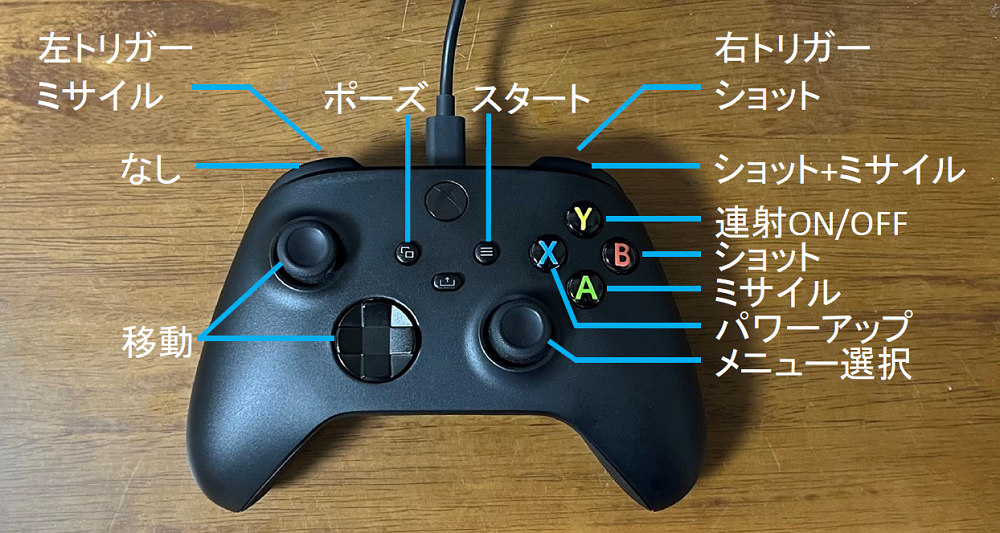

# X68000Z版グラディウスをXboxコントローラーでSteam版グラディウス風の操作で遊ぶ

## 概要
Arduino+USB Host ShieldでXboxコントローラをX68000Zに繋ぎSteam版グラディウス風の操作方法で遊べるようにするスケッチです。  

## 準備
Arduino+USB Host Shieldを組み合わせた回路が必要です。  
また、スケッチを書き込むためにArduino IDEとUSB_Host_Shield_2.0ライブラリの環境が必要です。  

## 使い方
Arduino+USB Host Shieldを組み合わせた回路にスケッチを書き込みます。  
X68000ZとArduino+USB Host Shieldを繋ぎ、Xboxコントローラーを接続をします。  

X68000Z版グラディウスをSteam版グラディウス風の操作で遊べるようになります。  
ただし、XboxコントローラーでX68000Zのゲームメニューの操作はできませんので、通常のゲームコントローラーやキーボードを併用してグラディウスを起動してください。

## キー設定
  
メニューボタン…スタート  
ビューボタン…ポーズ  
右スティック…メニュー選択  

左スティック…移動  
方向パッド…移動  

Aボタン…ミサイル  
Bボタン…ショット  
Xボタン…パワーアップ  
Yボタン…連射ON/OFF  
Lボタン…なし  
Rボタン…ショット+ミサイル  
左トリガー…ミサイル  
右トリガー…ショット  

## リリースノート

### 0.0.1

初版
